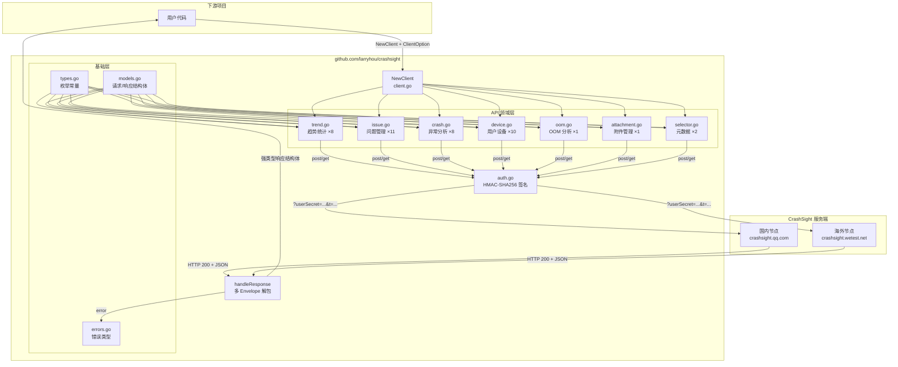
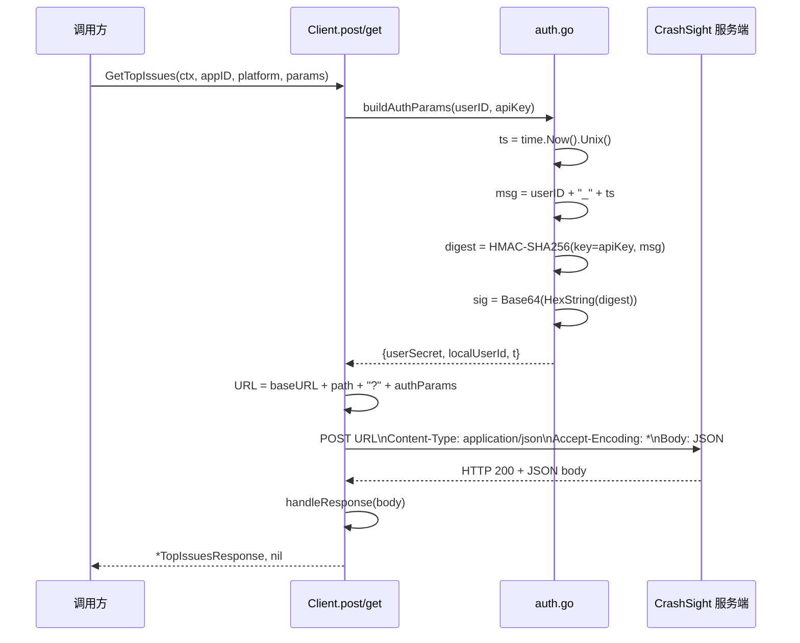
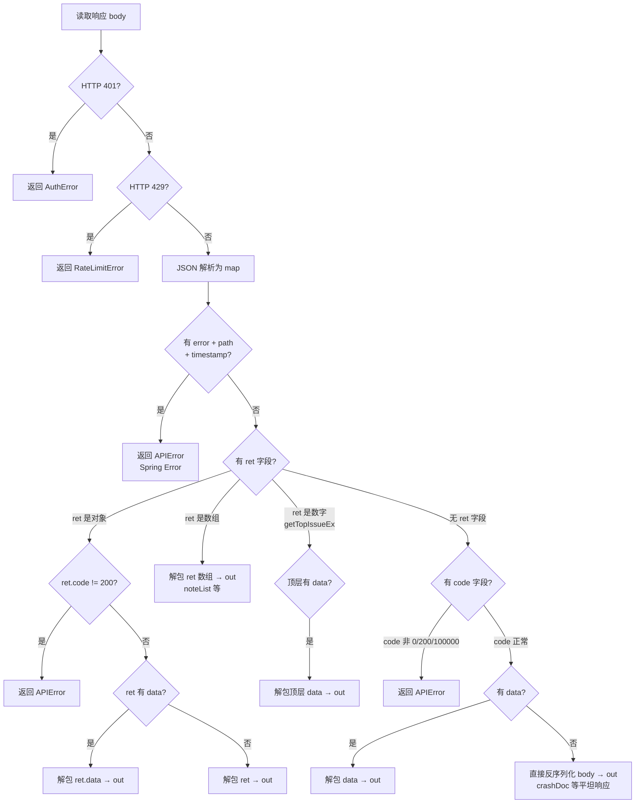
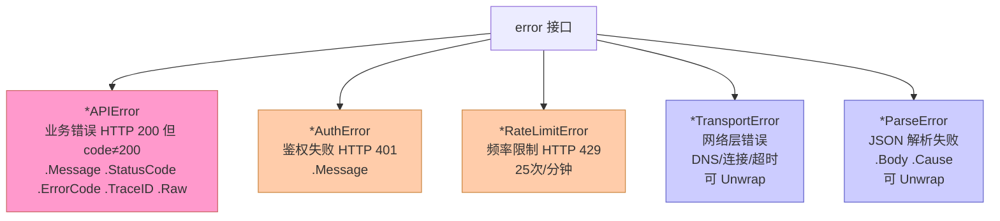
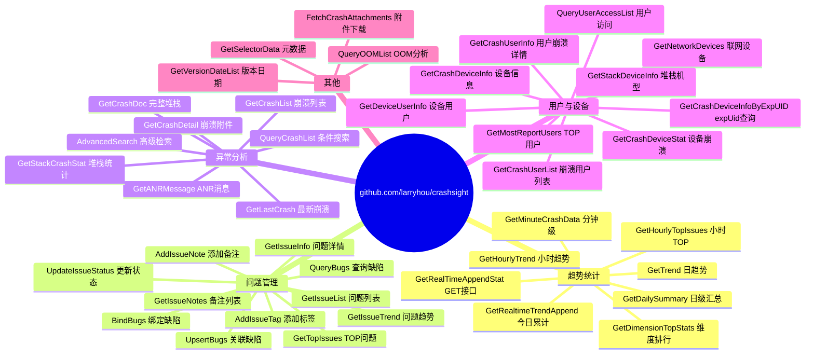
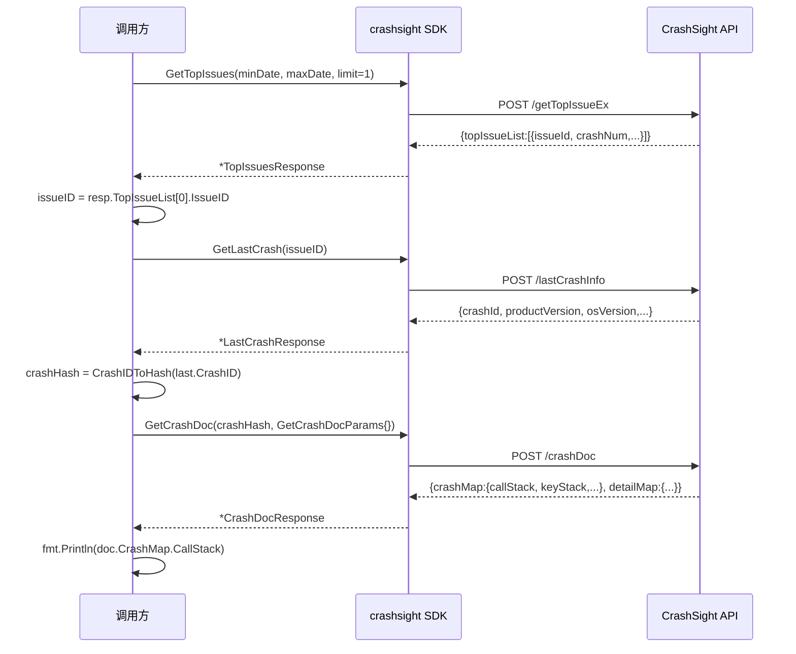
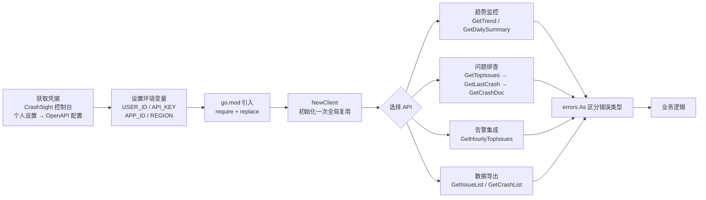

# CrashSight Go SDK — 架构与快速开始

## 项目位置

```
github.com/larryhou/crashsight
```

零外部依赖，全部使用 Go 标准库（`net/http`, `crypto/hmac`, `crypto/sha256`, `encoding/json` 等）。

---

## 一、整体架构



---

## 二、文件结构

```
module github.com/larryhou/crashsight
```

---

## 三、API 架构设计

### 3.1 Client — 并发安全

```go
type Client struct {
    userID  string
    apiKey  string
    baseURL string       // 初始化后只读
    http    *http.Client // 内置连接池，并发安全
}
```

- **所有字段 `NewClient` 后只读**，无任何可变共享状态，天然并发安全。
- 底层 `*http.Client` 自带连接池，多 goroutine 共享同一 `Client` 实例无需加锁。
- 签名在每次请求的调用栈内临时计算，不缓存，不共享。

### 3.2 函数式选项（ClientOption）

```go
client := crashsight.NewClient(userID, apiKey,
    crashsight.WithRegion(crashsight.RegionCN),   // 默认，可省略
    crashsight.WithTimeout(60*time.Second),
    crashsight.WithHTTPClient(customHC),           // 用于测试 mock
)
```

| 选项 | 说明 | 默认值 |
|---|---|---|
| `WithRegion(r)` | 切换部署区域（CN/SG） | `RegionCN` |
| `WithBaseURL(url)` | 自定义 URL，覆盖 Region | — |
| `WithTimeout(d)` | 请求超时 | `30s` |
| `WithHTTPClient(hc)` | 替换底层 HTTP 客户端 | 内置 |

### 3.3 方法签名规范

**统一形式：**

```go
func (c *Client) XxxMethod(
    ctx context.Context,          // 1. 总是第一个参数
    appID string,                 // 2. 必填业务参数直接列出
    platform Platform,            // 3. 平台类型（强类型枚举）
    p XxxParams,                  // 4. 可选/多参数通过 XxxParams 结构体传递
) (*XxxResponse, error)
```

**简单方法（≤3个参数）** 直接平铺，不用 Params 结构体：

```go
func (c *Client) GetIssueInfo(ctx context.Context, appID string, platform Platform, issueID string) (*IssueInfo, error)
func (c *Client) AddIssueTag(ctx context.Context, appID string, platform Platform, issueID, tagName string) error
```

### 3.4 鉴权流程



### 3.5 响应解包决策树



---

## 四、类型系统

### 4.1 枚举常量（types.go）

```go
// 平台
PlatformAndroid Platform = 1
PlatformIOS     Platform = 2
PlatformPC      Platform = 10

// 异常类型
CrashTypeCrash CrashType = "crash"
CrashTypeANR   CrashType = "anr"
CrashTypeError CrashType = "error"

// 设备类型
VmTypeAll        VmType = 0  // 全部
VmTypeRealDevice VmType = 1  // 真机
VmTypeEmulator   VmType = 2  // 模拟器

// 问题状态
IssueStatusUnprocessed IssueStatus = 0  // 未处理
IssueStatusProcessed   IssueStatus = 1  // 已处理
IssueStatusProcessing  IssueStatus = 2  // 处理中

// 区域
RegionCN Region = "cn"  // https://crashsight.qq.com
RegionSG Region = "sg"  // https://crashsight.wetest.net

// 趋势粒度
GranularityDay  GranularityUnit = "DAY"
GranularityHour GranularityUnit = "HOUR"

// 常用异常类型过滤字符串
ExceptionTypeCrash = "Crash,Native,ExtensionCrash"
ExceptionTypeANR   = "ANR"
ExceptionTypeError = "AllCatched,Unity3D,Lua,JS"
ExceptionTypeAll   = "AllCrash,ANR,AllCatched"

// TOP 问题数据类型
TopIssueDataTypeSystemExit   TopIssueDataType = "SystemExit"
TopIssueDataTypeUnSystemExit TopIssueDataType = "unSystemExit"
```

### 4.2 服务端类型陷阱（已修正）

以下字段**服务端返回类型与直觉不符**，models.go 已据实定义：

| 结构体 | 字段 | 实际 JSON 类型 | Go 类型 |
|---|---|---|---|
| `CrashMap` | `MemSize`, `DiskSize`, `FreeMem`, `FreeStorage`, `FreeSdCard`, `TotalSD` | 字符串 `"1587986432"` | `string` |
| `CrashMap` | `IsRooted`, `AppInBack` | 字符串 `"true"` | `string` |
| `CrashMap` | `IsVirtualMachine` | 整数 `0/1` | `int` |
| `CrashMap` | `GPU`, `GpuDriverVersion` | 字符串 | `string`（新增） |
| `LastCrashResponse` | `AppInBack`, `LaunchTime` | 字符串 | `string` |
| `TagInfo` | `TagID` | 整数 `69672` | `int64` |
| `VersionItem` | `Enable` | 整数 `0/1` | `int` |
| `VersionItem` | `IsShow`, `EnableAutoUpgrade` | bool | `bool` |
| `ProcessorItem` | `IsShow` | 字符串 `"true"` | `string` |
| `ProcessorItem` | `IsOperator` | 整数 `0/1` | `int` |
| `IssueInfo`/`GetCrashDoc` | `platformId`（请求体） | 字符串 | SDK 内部自动转换 |
| `CrashData` | `MemSize` | 字符串字节数 `"34265366528"` | `string`（需手动转 MB） |

### 4.3 工具函数

```go
// CrashID 转 CrashHash（每 2 位插 ":"）
// 例：c53bf046... → c5:3b:f0:46:...
crashsight.CrashIDToHash(crashID string) string
```

---

## 五、错误处理

### 5.1 错误类型层次



### 5.2 推荐错误处理模式

```go
items, err := client.GetTopIssues(ctx, appID, crashsight.PlatformPC, params)
if err != nil {
    var apiErr *crashsight.APIError
    var authErr *crashsight.AuthError
    var rateErr *crashsight.RateLimitError
    switch {
    case errors.As(err, &apiErr):
        log.Printf("业务错误: %s (status=%d, traceId=%s)",
            apiErr.Message, apiErr.StatusCode, apiErr.TraceID)
    case errors.As(err, &authErr):
        log.Fatalf("鉴权失败，检查 userID 和 apiKey: %s", authErr.Message)
    case errors.As(err, &rateErr):
        time.Sleep(5 * time.Second) // 等待后重试
    default:
        log.Printf("其他错误: %v", err)
    }
    return
}
```

---

## 六、API 方法全览

### 6.1 API 领域划分



### 6.2 趋势统计（trend.go）

| 方法 | 接口 | 关键参数 |
|---|---|---|
| `GetTrend` | `POST /getTrendEx` | `GetTrendParams{StartDate, EndDate, CrashType, VersionList}` |
| `GetDailySummary` | `POST /fetchDailySummary` | `GetDailySummaryParams{StartDate, EndDate, Version}` |
| `GetRealtimeTrendAppend` | `POST /getAppRealTimeTrendAppendEx` | `GetRealtimeTrendAppendParams{Date, CrashType}` |
| `GetHourlyTrend` | `POST /getRealTimeHourlyStatEx` | `GetHourlyTrendParams{StartHour, EndHour}` 格式 `YYYYMMDDHH` |
| `GetHourlyTopIssues` | `POST /getTopIssueHourly` | `GetHourlyTopIssuesParams{StartHour, Limit}` |
| `GetDimensionTopStats` | `POST /fetchDimensionTopStats` | `GetDimensionTopStatsParams{Field: "model"/"osVersion"/"version"}` |
| `GetMinuteCrashData` | `POST /getMinuteCrashData` | `GetMinuteCrashDataParams{StartTime, EndTime}` 格式 `YYYY-MM-DD HH:MM:SS` |
| `GetRealTimeAppendStat` | `GET /getRealTimeAppendStat` | `startHour, endHour` 格式 `YYYYMMDDHH` |

### 6.3 问题管理（issue.go）

| 方法 | 接口 | 说明 |
|---|---|---|
| `GetIssueList` | `POST /queryIssueList` | `GetIssueListParams{ExceptionTypeList, Rows, SortField, Status, Version}` |
| `GetTopIssues` | `POST /getTopIssueEx` | `GetTopIssuesParams{MinDate, MaxDate, VersionList, Limit}` |
| `GetIssueInfo` | `POST /issueInfo` | 单个 issue 详情 |
| `GetIssueNotes` | `GET /noteList/...` | `crashDataType` 默认 `"undefined"` |
| `GetIssueTrend` | `POST /queryIssueTrend` | `GetIssueTrendParams{IssueIDs, MinDate, MaxDate}` 日期格式 `YYYY-MM-DD HH:MM:SS` |
| `UpdateIssueStatus` | `POST /updateIssueStatus` | `UpdateIssueStatusParams{IssueIDs, Status, Note}` |
| `AddIssueNote` | `POST /addIssueNote` | `AddIssueNoteParams{IssueID, Note}` |
| `AddIssueTag` | `POST /addTag` | 直接传 `issueID, tagName` |
| `UpsertBugs` | `POST /upsertBugs` | `UpsertBugsParams{IssueID, Extra}` |
| `QueryBugs` | `POST /queryBugs` | `[]BugInfoParam{{BugPlatform, ID}}` |
| `BindBugs` | `POST /bindBugs` | `BindBugsParams{IssueID, BugID, BugURL}` |

### 6.4 异常分析（crash.go）

| 方法 | 接口 | 说明 |
|---|---|---|
| `GetCrashList` | `POST /crashList` | `GetCrashListParams{IssueID, Start, Rows}`；`Rows` 最大 100，`NumFound` 为总数，用 `start+=100` 分页；`crashDatas` 已含 `GPU/GpuDriverVersion/CpuName/MemSize` 完整设备字段，**无需再调 `GetCrashDoc`** |
| `GetLastCrash` | `POST /lastCrashInfo` | 返回 `LastCrashResponse.CrashID` |
| `GetCrashDetail` | `POST /appDetailCrash` | 返回日志/附件/KV，需先用 `CrashIDToHash` 转换 |
| `GetCrashDoc` | `POST /crashDoc` | 完整堆栈，`GetCrashDocParams{LogType, NeedCustomKV}`；`CrashMap` 含 `GPU`/`GpuDriverVersion`/`CpuName`/`MemSize` |
| `GetANRMessage` | `POST /appDetailCrash` | 过滤 `anrMessage.txt`/`trace.zip` |
| `QueryCrashList` | `POST /queryCrashList` | 按条件搜索，`QueryCrashListParams{Keyword, DeviceID, StartDate, EndDate ...}`；支持服务端日期过滤但**不支持按 issueId 过滤** |
| `AdvancedSearch` | `POST /advancedSearchEx` | `AdvancedSearchParams{StartHour, EndHour}` 格式 `YYYYMMDDHH` |
| `GetStackCrashStat` | `POST /getStackCrashStat/platformId/{pid}` | `GetStackCrashStatParams{KeyName, StartTime, EndTime}` 支持 `*` 通配 |

**crashList 分页拉取 + 日期过滤模式（`crashList` 无服务端日期参数，客户端过滤）：**

```go
const pageSize = 100
start := 0
for {
    resp, _ := client.GetCrashList(ctx, appID, platform, crashsight.GetCrashListParams{
        IssueID: issueID, Start: start, Rows: pageSize,
    })
    for _, crashID := range resp.CrashIDList {
        d := resp.CrashDatas[crashID]
        if !strings.HasPrefix(d.UploadTime, "2026-05-28") { // 日期过滤
            continue
        }
        // d.GPU / d.GpuDriverVersion / d.CpuName / d.MemSize 已可直接使用
        memMB, _ := strconv.ParseInt(d.MemSize, 10, 64)
        memMB /= 1024 * 1024
    }
    start += pageSize
    if len(resp.CrashIDList) < pageSize || start >= int(resp.NumFound) {
        break
    }
}
```

**crashDatas 设备字段说明（PC 平台）：**

| 字段 | 说明 | 示例 |
|---|---|---|
| `GPU` | GPU 型号 | `"NVIDIA GeForce RTX 4060"` |
| `GpuDriverVersion` | GPU 驱动版本 | `"32.0.15.7688"` |
| `CpuName` | CPU 型号 | `"Intel(R) Core(TM) i5-14400F"` |
| `MemSize` | 物理内存总量（字节字符串） | `"34265366528"` |
| `ProductVersion` | App 版本号 | `"Cloud.RealisticMP.2026-05-28.6230498"` |
| `UploadTime` | 上报时间（倒序排列） | `"2026-05-28 18:36:11"` |

**级联查询标准链路：**



### 6.5 用户与设备（device.go）

| 方法 | 接口 | 说明 |
|---|---|---|
| `QueryUserAccessList` | `POST /queryAccessList` | `UserIDList`/`DeviceIDList` 二选一 |
| `GetCrashUserInfo` | `POST /getCrashUserInfo/platformId/{pid}` | 按 openId 查崩溃详情 |
| `GetCrashUserList` | `POST /getCrashUserList/platformId/{pid}` | 时间段内崩溃用户列表（最长 30 天）|
| `GetMostReportUsers` | `POST /getMostReportUser` | `NeedDistinctCount *bool`（nil=默认 true）|
| `GetNetworkDevices` | `POST /getNetworkDevices/platformId/{pid}` | 仅移动端 Android/iOS |
| `GetCrashDeviceStat` | `POST /getCrashDeviceStat/platformId/{pid}` | 按 deviceId 查崩溃 |
| `GetCrashDeviceInfo` | `POST /getCrashDeviceInfo/platformId/{pid}` | 按 issueId 查设备，移动端 |
| `GetDeviceUserInfo` | `POST /getDeviceUserInfo/platformId/{pid}` | 按 deviceId 查 OpenId，移动端 |
| `GetStackDeviceInfo` | `POST /getStackDeviceInfo/platformId/{pid}` | 按堆栈关键字查机型 |
| `GetCrashDeviceInfoByExpUID` | `POST /getCrashDeviceInfoByExpUid/platformId/{pid}` | 按 expUid 查设备，移动端 |

### 6.6 其他（oom.go / attachment.go / selector.go）

```go
// OOM 分析
client.QueryOOMList(ctx, appID, QueryOOMListParams{
    Limit: 20,
    SearchConditionGroup: SearchConditionGroup{
        Conditions: []SearchCondition{{
            QueryType: QueryTypeTerm,
            Term:      string(OOMStatusOnlyIsOOM),
            Field:     "oomStatus",
        }},
    },
})

// 附件下载（attachmentFilenameList 为空时静默返回空列表）
client.FetchCrashAttachments(ctx, appID, FetchCrashAttachmentsParams{
    CrashIDList:            []string{crashID},
    AttachmentFilenameList: []string{"SDK_LOG", "anrMessage.txt"},
})

// 元数据：版本/标签/处理人列表
client.GetSelectorData(ctx, appID, platform, GetSelectorDataParams{
    Types: "version,tag,member",  // 默认全部
})

// 版本首次出现日期
client.GetVersionDateList(ctx, appID, platform)
```

---

## 七、下游项目快速开始

### 7.1 集成流程



### 7.2 引入 SDK

当前为本地 module，推荐通过 `replace` 指令引入：

```go
// 下游项目 go.mod
module your-project

go 1.21

require github.com/larryhou/crashsight v0.0.0

replace github.com/larryhou/crashsight => /path/to/crashsight
```

待正式打 tag 后可直接引入：

```go
require github.com/larryhou/crashsight v1.0.0
```

### 7.3 凭据获取

登录 CrashSight 控制台 → 右上角头像 → **个人设置** → **OpenAPI 配置**

| 字段 | 说明 |
|---|---|
| `localUserId` | 数字用户 ID（非账号名） |
| `userOpenapiKey` | OpenAPI 密钥（UUID 格式）|
| `appId` | 项目 appId（字母+数字） |

**通过环境变量注入（推荐，避免硬编码）：**

```bash
export CRASHSIGHT_USER_ID=<localUserId>
export CRASHSIGHT_API_KEY=<userOpenapiKey>
export CRASHSIGHT_APP_ID=<appId>
export CRASHSIGHT_REGION=cn   # cn 或 sg
```

### 7.4 最简示例

```go
package main

import (
    "context"
    "fmt"
    "log"
    "os"
    "time"

    crashsight "github.com/larryhou/crashsight"
)

func main() {
    client := crashsight.NewClient(
        os.Getenv("CRASHSIGHT_USER_ID"),
        os.Getenv("CRASHSIGHT_API_KEY"),
        crashsight.WithRegion(crashsight.RegionCN),
    )
    ctx := context.Background()
    appID := os.Getenv("CRASHSIGHT_APP_ID")

    // 获取最近 7 天趋势
    end := time.Now()
    start := end.AddDate(0, 0, -7)
    items, err := client.GetTrend(ctx, appID, crashsight.PlatformPC, crashsight.GetTrendParams{
        StartDate:     start.Format("20060102"),
        EndDate:       end.Format("20060102"),
        VersionList:   []string{"-1"},
        MergeVersions: true,
    })
    if err != nil {
        log.Fatal(err)
    }
    for _, item := range items {
        fmt.Printf("date=%-10s crash=%d/%d access=%d\n",
            item.Date, item.CrashNum, item.CrashUser, item.AccessUser)
    }
}
```

### 7.5 运行集成测试

```bash
cd crashsight
CRASHSIGHT_USER_ID=<userId> \
CRASHSIGHT_API_KEY=<apiKey> \
CRASHSIGHT_APP_ID=<appId> \
CRASHSIGHT_REGION=cn \
go test -v -run TestIntegration -timeout 180s
```

### 7.6 Python vs Go 对比测试

```bash
cd /path/to/crashsight
CRASHSIGHT_USER_ID=<userId> \
CRASHSIGHT_API_KEY=<apiKey> \
CRASHSIGHT_APP_ID=<appId> \
CRASHSIGHT_REGION=cn \
python3 compare_test.py
```

### 7.7 dailyscan — 崩溃全量扫描（支持时间窗口）

`cmd/dailyscan` 扫描指定时间窗口内所有 TOP issue，输出每条 crash 的完整设备信息（GPU/CPU/Memory/Driver）。

**`-days N` 语义：** N 天前到今天，共 N+1 天的累积数据。`-days 0`（默认）= 仅今天。

**流程：**
1. `GetTopIssues(startDate, endDate)` 拉时间窗口内 TOP 100 issue（1 次请求）
2. 每个 issue 调 `GetCrashList`（每页 100 条，分页循环），客户端按 `uploadTime[:10]` 匹配日期集合，倒序时末条日期早于 startDate 可提前终止
3. `crashDatas` 已含所有设备字段，无需 `GetCrashDoc`

```bash
# 默认：只看今天，过滤 Physical.RealisticMP / Cloud.RealisticMP，输出 stdout
go run ./cmd/dailyscan

# 输出到文件
go run ./cmd/dailyscan -out report.json

# 最近 3 天（2 天前到今天）
go run ./cmd/dailyscan -days 2 -out report.json

# 自定义版本前缀（可多次指定）
go run ./cmd/dailyscan -version-prefix Physical.Ma3 -version-prefix Cloud.Ma3

# 调试：只扫描前 N 个 issue，每 issue 最多 M 条 crash
go run ./cmd/dailyscan -max-issues 5 -rows 200
```

**输出 JSON 结构：**
```json
{
  "startDate": "20260526",
  "endDate": "20260528",
  "appId": "3f8a39cdee",
  "platform": "PC",
  "versionPrefixes": ["Physical.RealisticMP", "Cloud.RealisticMP"],
  "totalIssue": 100,
  "totalCrash": 342,
  "issues": [{
    "issueId": "878542d1bc9f832123b71910c3df28fa",
    "exceptionName": "UNREAL_ASSERT_EXCEPTION(0x00004000)",
    "crashNum": 17,
    "crashUser": 15,
    "crashes": [{
      "crashId": "caaa5a6c270f4c1d97c77f90a8c62737",
      "uploadTime": "2026-05-28 18:36:11",
      "appVersion": "Cloud.RealisticMP.2026-05-28.6230498",
      "gpu": "NVIDIA GeForce RTX 5090 D v2",
      "gpuDriverVersion": "32.0.15.9579",
      "cpu": "AMD Ryzen 9 9950X 16-Core Processor",
      "memoryMB": 128568,
      "deviceId": "00-ff-34-84-1d-a1",
      "userId": "Administrator",
      "osVer": "Microsoft Windows 11(22631)"
    }]
  }]
}
```

---

## 八、注意事项

| 事项 | 说明 |
|---|---|
| **限速** | 同一用户所有接口合计 **25 次/分钟**，超出返回 HTTP 429 → `RateLimitError` |
| **platformId 类型** | `issueInfo`/`lastCrashInfo`/`crashDoc`/`appDetailCrash` 请求体中 platformId 需为**字符串**，SDK 内部已自动处理 |
| **crashHash 转换** | `GetCrashDoc`/`GetCrashDetail` 需传 crashHash（非 crashId），用 `CrashIDToHash()` 转换 |
| **移动端专用** | `GetNetworkDevices`/`GetCrashDeviceInfo`/`GetDeviceUserInfo` 仅支持 Android/iOS |
| **GetMinuteCrashData** | 响应可能超过 30s，建议 `WithTimeout(120*time.Second)` |
| **GetIssueTrend 日期格式** | `MinDate`/`MaxDate` 格式为 `YYYY-MM-DD HH:MM:SS`，注意勿混用 Go format 字符串 |
| **并发安全** | `Client` 可跨 goroutine 共享，无需加锁 |
| **context 超时** | 所有方法接受 `context.Context`，推荐配合 `context.WithTimeout` 控制单次调用 |
| **GetCrashList 分页** | `Rows` 最大 **100**（官方限制），`NumFound` 为总量，需用 `start+=100` 循环翻页 |
| **GetCrashList 排序** | 按 `uploadTime` **倒序**返回，无法指定排序字段；按 issue 拉全量历史，无服务端日期过滤参数，需客户端按 `uploadTime` 前缀过滤 |
| **GetCrashList 设备字段** | `crashDatas` 已含 `gpu/gpuDriverVersion/cpuName/memSize`，**无需再调 `GetCrashDoc`** 补充设备信息 |
| **crashDataType 参数** | `/crashList` body 中 `crashDataType` 固定传 `"undefined"`，SDK 已内置，无需手动设置 |
| **GetVersionDateList 列顺序** | 服务端实际返回 3 列 `["dtEventTime","product_version","first_date"]`，SDK 按 columns 动态定位，`first_date` 格式 `"2026-05-28"` |
